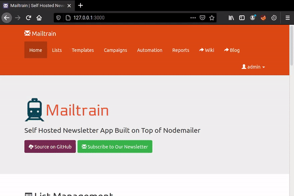
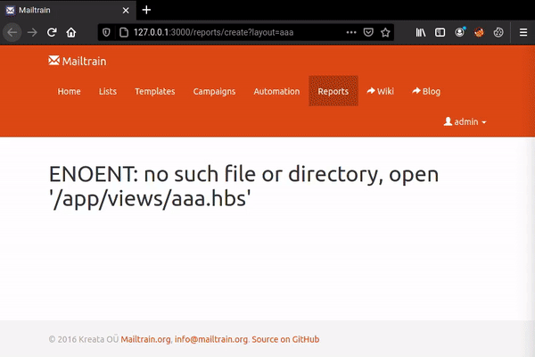
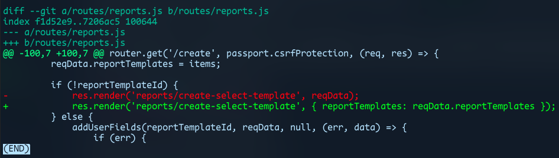

Hello mates, this is my first write-up.

Let's keep it simple, most of the people who are reading this might have struggled a lot or is still fighting to find his/her first bug.
Well I've a good news for you, it's all about how you can earn some extra bucks with open-source bug bounty. Yeah, you heard that right - bounty for vulnerabilities in open-source projects.

Introducing [huntr.dev], a bug bounty board for securing open-source code, it helps the open-source community to disclose and fix security issues and get paid to do it. I've been using it for few months and the experience is pretty amazing. I was able to disclose over 40 and fixed over 90 security issues (including npm packages that has 250k average downloads per week). 2 CVE IDs were assigned to me for my findings in packages [nested-object-assign] and [apexcharts]. Check them out here!

- [CVE-2021-23329]{:target="_blank"}
- [CVE-2021-23327]{:target="_blank"}

If you like reading code or wants to secure the open-source code (but for some $$$😅), join [huntr][huntr.dev] now!

Enough with that, let's jump into one of my recent disclosures in huntr which was a **Directory Traversal** vulnerability in the [repo][Mailtrain-repo] of the well known newsletter platform [Mailtrain].

I usually choose JavaScript apps and packages as my targets. Github of course, grep.app and npmjs are my go-to resources for finding targets. For example if you want web apps built with **express.js**, search `require('express')` in github. Use filters to get recently active projects.

I was reading code of all the Mailtrain's routes to identify available features. One of the route handler is `routes/reports.js` [source][vulnerable-source]{:target="_blank"}


78    router.get('/create', passport.csrfProtection, (req, res) => {
79      const reqData = req.query;
80      // ...
102       if (!reportTemplateId) {
103           res.render('reports/create-select-template', reqData);
104       }
105     // ...
115   });


If you are little bit familiar with **express.js**, you would say that the line 103 simply renders a template named `create-select-template`. And what about `reqData`? Yeah that's right, it's an object that has all the query string parameters passed to this route. So basically it is whatever a user gives as GET parameters.

But this simple line of code doesn't seems to be vulnerable to anything right?

{:width="60%"}

When I saw this, one of the write-ups I read few months ago came into my mind. If you are interested in knowing about the root cause of the issue, read it [here][write-up]{:target="_blank"}.

**TL;DR**: If an express server is using `hbs` as view engine for server-side rendering and it allowes user-constructed query string parameters without validation to get passed to express's `render()` function, an attacker can use parameter called `layout` to read arbitrary files in the web server.

If you read the source above, you can see that it uses `hbs`. At this moment, I was sure it is vulnerable. To test it, I setup Mailtrain locally. Since acces to this route requires authentication, the default creds from the repo can be used. With a little curiosity, I gave the `layout` parameter and got what I expected.

{:alt="PoC"}
<figcaption>PoC 01</figcaption>

{:width="60%"}

Yeah! Directory traversal🔥. With that, reading local files was easy as...

{:alt="PoC"}
<figcaption>PoC 02</figcaption>

I quickly disclosed this [issue][disclosure]{:target="_blank"} and also opened a [PR][fix]{:target="_blank"} with fix. The fix is simple. Instead of allowing to pass all query string parameters, allow only what is necessary.

<figcaption>Change diff</figcaption>

Within few days, the maintainer of Mailtrain reviewed and accepted it. And I got the💰.

{:width="60%"}

I've also requested a CVE for this bug and waiting to hear back from the CNA.

That's all for now. Stay safe❤️.

[huntr.dev]: https://huntr.dev
[nested-object-assign]: https://www.npmjs.com/package/nested-object-assign
[apexcharts]: https://www.npmjs.com/package/apexcharts
[CVE-2021-23327]: https://cve.mitre.org/cgi-bin/cvename.cgi?name=CVE-2021-23327
[CVE-2021-23329]: https://cve.mitre.org/cgi-bin/cvename.cgi?name=CVE-2021-23329
[Mailtrain]: https://mailtrain.org
[Mailtrain-repo]: https://github.com/Mailtrain-org/mailtrain
[vulnerable-source]: https://github.com/Mailtrain-org/mailtrain/blob/1d34f4f14d02c2d5794e37d0431118e0e41e4e71/routes/reports.js#L78
[write-up]: https://blog.shoebpatel.com/2021/01/23/The-Secret-Parameter-LFR-and-Potential-RCE-in-NodeJS-Apps/
[disclosure]: https://huntr.dev/bounties/1-other-mailtrain/
[fix]: https://github.com/Mailtrain-org/mailtrain/pull/1029
[diff]: https://github.com/Mailtrain-org/mailtrain/pull/1029/files